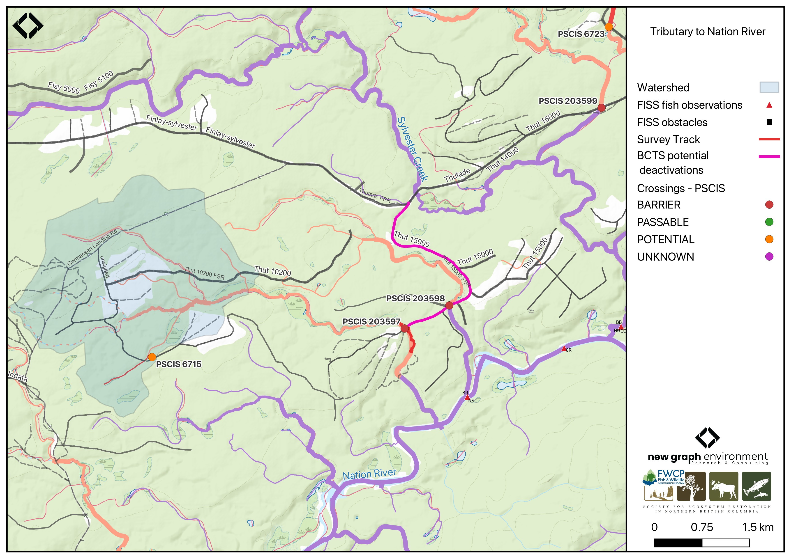

```{r setup-203597, eval = F}
knitr::opts_chunk$set(echo=FALSE, message=FALSE, warning=FALSE)
source('scripts/packages.R')
source('scripts/tables.R')
source('scripts/functions.R')
```

```{r  load-data-203597}
my_site <- 203597
```

`r fpr::fpr_appendix_title()`


## Site Location {.unnumbered}

PSCIS crossing `r as.character(my_site)` is located on `r fpr::fpr_my_pscis_info()`, approximately 65km west of McKenzie, BC, as the crow flies, and is in the Nation River watershed group (Figure \@ref(fig:map-203597)). The crossing is located `r round(fpr::fpr_my_bcfishpass(col_pull = downstream_route_measure)*0.001, 1)`m upstream of the stream’s confluence with the Nation River on `r fpr_my_pscis_info(col_pull = road_name, site = my_site)` road and is situated under Sekani Forest Products Ltd. road tenure R07214 8. 

<br>

```{r map-203597, fig.cap = my_caption, eval = T}
 my_caption <- "Map of Tributary To Nation River"
 
 
 
```

<br>

## Background {.unnumbered}

At PSCIS crossing `r as.character(my_site)`, `r fpr::fpr_my_pscis_info()` is a
`r fpr::fpr_my_bcfishpass() |>english::ordinal()` order stream and drains a watershed of approximately
`r fpr::fpr_my_wshd()`km^2^. The watershed ranges in elevation from
a maximum of `r fpr::fpr_my_wshd(col = 'elev_max')`m to
`r fpr::fpr_my_wshd(col = 'elev_site')`m near the crossing (Table
\@ref(tab:tab-wshd-203597)).

<br>

This was the first assessment of PSCIS crossing `r as.character(my_site)`, in part because the site is situated on a road identified by BC Timber Sales as a potential deactivation candidate. The stream exhibited high-quality habitat, so a habitat confirmation was completed. Bull trout are documented in the Nation River near the confluence with this stream [@norris2024smnorrisbcfishobs; @moe2024KnownBC].

<br>

<!-- `r fpr::fpr_my_fish_sp()` have previously been recorded [@norris2024smnorrisbcfishobs; @moe2024KnownBC]. -->

A summary of habitat modelling outputs for the crossing are presented in Table
\@ref(tab:tab-culvert-bcfp-203597).


<br>

```{r tab-wshd-203597, eval = T}
fpr::fpr_table_wshd_sum(site_id = my_site) |>
  fpr::fpr_kable(caption_text = paste0('Summary of derived upstream watershed statistics for PSCIS crossing ', my_site, '.'),
           footnote_text = 'Elev P60 = Elevation at which 60% of the watershed area is above',
           scroll = F)

```

<br>

```{r tab-culvert-bcfp-203597, eval = T}
fpr::fpr_table_bcfp(scroll = F) 
```

<br>


## Stream Characteristics at Crossing `r as.character(my_site)` {.unnumbered}

At the time of the 2025 assessment, PSCIS crossing `r as.character(my_site)` on `r fpr_my_pscis_info(col_pull = road_name, site = my_site)` was un-embedded, non-backwatered and ranked as `r fpr::fpr_my_pscis_info(col_pull = barrier_result) |>stringr::str_to_lower()` to upstream fish passage according to the provincial protocol [@moe2011Fieldassessment] (Table \@ref(tab:tab-culvert-203597)).

<br>

The water temperature was `r fpr::fpr_my_habitat_info(loc = "ds", col_pull = 'temperature_c')`$^\circ$C,
pH was `r fpr::fpr_my_habitat_info(loc = "ds", col_pull = 'p_h')` and
conductivity was `r fpr::fpr_my_habitat_info(loc = "ds", col_pull = 'conductivity_m_s_cm')` uS/cm.

`r if(identical(gitbook_on, FALSE)){knitr::asis_output("\\pagebreak")}`

<br>

```{r tab-culvert-203597, eval = T}
fpr::fpr_table_cv_summary_memo()

```


<br>

```{r eval=F}
##this is useful to get some comments for the report
hab_site |>filter(site == my_site & location == 'ds') |>pull(comments)
hab_site |>filter(site == my_site & location == 'us') |>pull(comments)

```


## Stream Characteristics Downstream of Crossing `r as.character(my_site)` {.unnumbered}

`r fpr_my_survey_dist(loc = 'ds')` `r if(gitbook_on){knitr::asis_output("(Figure \\@ref(fig:photo-203597-01)).")}else(knitr::asis_output("(Figure \\@ref(fig:photo-203597-d01))."))` The stream had good flow, likely elevated due to significant precipitation the previous night. Abundant gravels were present throughout, and cover was provided by multiple sources including woody debris and undercut banks. No barriers were observed. `r fpr_my_habitat_paragraph(loc = 'ds')`

<br>

## Stream Characteristics Upstream of Crossing `r as.character(my_site)` {.unnumbered}

`r fpr_my_survey_dist(loc = 'us')` up to the beginning of the wetlands `r if(gitbook_on){knitr::asis_output("(Figure \\@ref(fig:photo-203597-02)).")}else(knitr::asis_output("(Figure \\@ref(fig:photo-203597-d01))."))` The habitat was rated as `r fpr::fpr_my_priority_info(loc = 'us') |>stringr::str_to_lower()` value. `r fpr_my_habitat_paragraph(loc = 'us')` The stream had good flow, although recent rainfall may have influenced discharge. Pockets of gravels were present within the area surveyed. Wetlands adjacent to the channel appeared shallow, suggesting they may freeze to the bottom during winter.


<br>

```{r eval=F}
##this is useful to get some comments for the report
form_edna |>filter(site == my_site & location == 'ds') |>pull(comments_field)
form_edna |>filter(site == my_site & location == 'ds') |>pull(comments_lab)


form_edna |>filter(site == my_site & location == 'us') |>pull(comments_field)
form_edna |>filter(site == my_site & location == 'us') |>pull(comments_lab)

```


## Environmental DNA Sampling {.unnumbered}

eDNA samples were collected both upstream and downstream of crossing `r as.character(my_site)` on `r fpr_my_pscis_info(col_pull = road_name, site = my_site)`, with sampling techniques summarized in Table \@ref(tab:tab-edna-203597).

<br>

```{r tab-edna-203597}
my_caption <- paste0("Summary of eDNA samples collected at site ", my_site, ".")

tab_edna |>
  dplyr::filter(site == my_site) |>
  dplyr::select(-site) |>
    dplyr::arrange(Site) |>
  fpr_kable(caption_text = my_caption, scroll = FALSE)

```


<br>

## Environmental DNA Results {.unnumbered}

```{r tab-edna-results-203597-prep, include=FALSE}
edna_results_203597 <- edna_bystargets_peace |>
  dplyr::filter(grepl("^203597", site_id), !control_blank_field, !control_blank_office) |>
  dplyr::group_by(site_id) |>
  dplyr::summarise(
    `UNBC ID`        = paste(sort(unique(unlist(strsplit(lab_ids, ", ")))), collapse = ", "),
    `Detected`       = fmt_targets(target[any_clean], max_pos[any_clean], retested[any_clean]),
    `Sub-threshold`  = fmt_targets(target[any_crude & !any_clean],
                                   max_pos[any_crude & !any_clean],
                                   retested[any_crude & !any_clean]),
    `Not detected`   = fmt_targets(target[!any_crude],
                                   max_pos[!any_crude],
                                   retested[!any_crude]),
    .groups = "drop"
  ) |>
  dplyr::rename(`Site ID` = site_id) |>
  dplyr::arrange(`Site ID`)
```

eDNA samples were collected upstream and downstream of crossing `r as.character(my_site)` and submitted to UNBC for ddPCR analysis against Bull Trout, Arctic Grayling, Rainbow Trout, and Kokanee assays (the SOCK ddPCR assay does not distinguish between anadromous Sockeye Salmon and landlocked Kokanee; in Peace tributaries above the Peace Canyon Dam, any SOCK detection would be Kokanee). Per-position results from real environmental samples are summarized in Table \@ref(tab:tab-edna-results-203597). Detections are based on the standard ddPCR call threshold of ≥4 positive droplets; format is `CODE(max_droplets)`, with `*` flagging samples UNBC reran.

<br>

```{r tab-edna-results-203597}
edna_results_203597 |>
  fpr::fpr_kable(
    caption_text = paste0("eDNA detection results at crossing ", my_site, " (real environmental samples)."),
    scroll = FALSE
  )
```

<br>

**Field blank at this crossing.** Sample `203597_ds_ed1a` (UNBC ID M41365) was a field blank — distilled water filtered at the field site to test for protocol contamination, not site eDNA. UNBC's analysis returned a low-level Rainbow Trout signal at this blank (4 positive droplets, ≈0.27 copies/μL). Per ddPCR convention this represents protocol-side contamination during collection or processing, not species presence at this location. The blank is presented in the Controls layer of the interactive map (off by default) and in the field-blanks table within [Appendix - Environmental DNA Results](#app-edna).

<br>

Site-level detail across all sampled crossings is in [Appendix - Environmental DNA Results](#app-edna). The `r ngr::ngr_str_link_url(url_base = params$report_url, url_resource = "edna_unbc_results_2025_peace_map.html", anchor_text = "interactive Peace eDNA map")` shows toggleable per-species layers.

<br>

## Structure Remediation and Cost Estimate {.unnumbered}

Ideally, this crossing is deactivated by BC Timber Sales; however, if restoration or maintenance activities proceed, replacement of the `r fpr_my_pscis_info(col_pull = road_name)` crossing (`r as.character(my_site)`) with a bridge (`r fpr::fpr_my_pscis_info(col_pull = recommended_diameter_or_span_meters)`m span) is recommended. At the time of reporting in 2026, the cost of the work is estimated at \$`r format(fpr::fpr_my_cost_estimate(), big.mark = ',')`.

<br>


## Conclusion {.unnumbered}

The habitat upstream of PSCIS crossing `r as.character(my_site)` on `r fpr_my_pscis_info(col_pull = road_name, site = my_site)` was documented as medium value for salmonid spawning and rearing, and the crossing is rated as a `r fpr_my_pscis_info(col_pull = my_priority, site = my_site)` to be deactivated hopefully by BC Timber Sales. 

`r if(gitbook_on){knitr::asis_output("<br>")} else knitr::asis_output("\\pagebreak")`

<br>

```{r tab-habitat-summary-203597, eval = T}
tab_hab_summary |>
  dplyr::filter(Site %in% c(my_site)) |> 
  fpr::fpr_kable(caption_text = paste0("Summary of habitat details for PSCIS crossing ", my_site, "."),
                 scroll = F) 

```

`r if(gitbook_on){knitr::asis_output("<br>")} else knitr::asis_output("\\pagebreak")`

```{r photo-203597-01-prep, eval=T}
my_photo1 = fpr::fpr_photo_pull_by_str(str_to_pull = 'ds_typical_1_')

my_caption1 = paste0('Typical habitat downstream of PSCIS crossing ', my_site, '.')


```

```{r photo-203597-01, fig.cap= my_caption1, out.width = photo_width, eval=gitbook_on}
knitr::include_graphics(my_photo1)
```

<br>

```{r photo-203597-02-prep, eval=T}
my_photo2 = fpr::fpr_photo_pull_by_str(str_to_pull = 'us_typical_2_')

my_caption2 = paste0('Wetland habitat located 350m upstream of PSCIS crossing ', my_site, '.')


```

```{r photo-203597-02, fig.cap= my_caption2, out.width = photo_width, eval=gitbook_on}
knitr::include_graphics(my_photo2)
```

```{r photo-203597-d01, fig.cap = my_caption, fig.show="hold", out.width= c("49.5%","1%","49.5%"), eval=identical(gitbook_on, FALSE)}
my_caption <- paste0('Left: ', my_caption1, ' Right: ', my_caption2)

knitr::include_graphics(my_photo1)
knitr::include_graphics("fig/pixel.png")
knitr::include_graphics(my_photo2)
```
