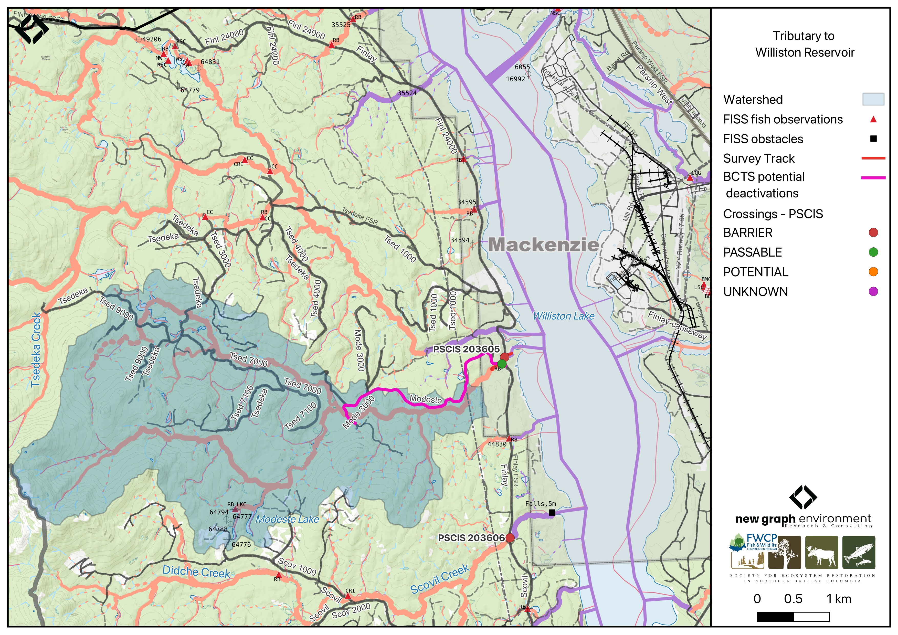

```{r setup-203605, eval = F}
knitr::opts_chunk$set(echo=FALSE, message=FALSE, warning=FALSE)
source('scripts/packages.R')
source('scripts/tables.R')
source('scripts/functions.R')
```

```{r  load-data-203605}
my_site <- 203605
my_site2 <- 203611
```

`r fpr::fpr_appendix_title()`


## Site Location {.unnumbered}

PSCIS crossing `r as.character(my_site)` is located on `r fpr::fpr_my_pscis_info()`, on the western side of the reservoir, approximately 10km southeast of MacKenzie, BC, in the Parsnip Arm watershed group (Figure \@ref(fig:map-203605)). The crossing is located `r round(fpr::fpr_my_bcfishpass(col_pull = downstream_route_measure)*0.001, 1)`m upstream of the stream’s confluence with the Williston Reservoir on `r fpr_my_pscis_info(col_pull = road_name, site = my_site)` road which is the responsibility of the Ministry of Forests.

<br>

```{r map-203605, fig.cap = my_caption, eval = T}
 my_caption <- "Map of Tributary To Williston Reservoir"
 
 
 
```

<br>

## Background {.unnumbered}

At PSCIS crossing `r as.character(my_site)`, `r fpr::fpr_my_pscis_info()` is a
`r fpr::fpr_my_bcfishpass() |>english::ordinal()` order stream and drains a watershed of approximately
`r fpr::fpr_my_wshd()`km^2^. The watershed ranges in elevation from
a maximum of `r fpr::fpr_my_wshd(col = 'elev_max')`m to
`r fpr::fpr_my_wshd(col = 'elev_site')`m near the crossing (Table
\@ref(tab:tab-wshd-203605)).

<br>

This was the first assessment of PSCIS crossing `r as.character(my_site)`, selected because it is located very close to Williston Reservoir, which supports documented bull trout. Approximately 35km of bull trout rearing habitat is modelled upstream with no additional modelled barriers, and `r fpr::fpr_my_fish_sp()` have previously been recorded in the system [@norris2024smnorrisbcfishobs; @moe2024KnownBC].The stream exhibited high-quality habitat, therefore a habitat confirmation was completed.

<br>

Approximately 215m upstream of `r fpr_my_pscis_info(col_pull = road_name, site = my_site)`, the stream crosses `r fpr_my_pscis_info(dat = pscis_phase1, col_pull = road_name, site = my_site2)` at a bridge, which was also assessed for the first time in 2025 (PSCIS crossing `r as.character(my_site2)`). `r fpr_my_pscis_info(dat = pscis_phase1, col_pull = road_name, site = my_site2)` provides access to the lower half of the watershed, and is identified by BC Timber Sales as a potential deactivation candidate.

<br>

A summary of habitat modelling outputs for the crossing are presented in Table
\@ref(tab:tab-culvert-bcfp-203605).


<br>

```{r tab-wshd-203605, eval = T}
fpr::fpr_table_wshd_sum(site_id = my_site) |>
  fpr::fpr_kable(caption_text = paste0('Summary of derived upstream watershed statistics for PSCIS crossing ', my_site, '.'),
           footnote_text = 'Elev P60 = Elevation at which 60% of the watershed area is above',
           scroll = F)

```

<br>

```{r tab-culvert-bcfp-203605, eval = T}
fpr::fpr_table_bcfp(scroll = F) 
```

<br>


## Stream Characteristics at Crossing `r as.character(my_site)` {.unnumbered}

At the time of the 2025 assessment, PSCIS crossing `r as.character(my_site)` on `r fpr_my_pscis_info(col_pull = road_name, site = my_site)` was un-embedded, non-backwatered and ranked as `r fpr::fpr_my_pscis_info(col_pull = barrier_result) |>stringr::str_to_lower()` to upstream fish passage according to the provincial protocol [@moe2011Fieldassessment] (Table \@ref(tab:tab-culvert-203605)). The culvert had a 0.95m outlet drop and a 0.5m deep outlet pool.

<br>

The water temperature was `r fpr::fpr_my_habitat_info(loc = "ds", col_pull = 'temperature_c')`$^\circ$C,
pH was `r fpr::fpr_my_habitat_info(loc = "ds", col_pull = 'p_h')` and
conductivity was `r fpr::fpr_my_habitat_info(loc = "ds", col_pull = 'conductivity_m_s_cm')` uS/cm.

`r if(identical(gitbook_on, FALSE)){knitr::asis_output("\\pagebreak")}`

<br>

```{r tab-culvert-203605, eval = T}
fpr::fpr_table_cv_summary_memo()

```


<br>

```{r eval=F}
##this is useful to get some comments for the report
hab_site |>filter(site == my_site & location == 'ds') |>pull(comments)
hab_site |>filter(site == my_site & location == 'us') |>pull(comments)

```


## Stream Characteristics Downstream of Crossing `r as.character(my_site)` {.unnumbered}

`r fpr_my_survey_dist(loc = 'ds')`to the mapped reservoir location, where the channel retained stream characteristics at the time of assessment `r if(gitbook_on){knitr::asis_output("(Figure \\@ref(fig:photo-203605-01)).")}else(knitr::asis_output("(Figure \\@ref(fig:photo-203605-d01))."))` Abundant gravels and cover were present throughout, with numerous run sections providing suitable rearing habitat for juvenile westslope cutthroat trout and rainbow trout. No barriers to fish passage were observed in the area surveyed and the habitat was rated as `r fpr::fpr_my_priority_info(loc = 'ds') |>stringr::str_to_lower()` value for salmonid spawning and rearing. `r fpr_my_habitat_paragraph(loc = 'ds')`

<br>

## Stream Characteristics Upstream of Crossing `r as.character(my_site)` {.unnumbered}

`r fpr_my_survey_dist(loc = 'us')` `r if(gitbook_on){knitr::asis_output("(Figure \\@ref(fig:photo-203605-02)).")}else(knitr::asis_output("(Figure \\@ref(fig:photo-203605-d01))."))` The habitat was rated as `r fpr::fpr_my_priority_info(loc = 'us') |>stringr::str_to_lower()` value. `r fpr_my_habitat_paragraph(loc = 'us')` The stream was large with complex habitat and diverse cover including deep pools, boulders, large and small woody debris, and undercut banks. A canyon section ~100m long occurred ~100m upstream of the `r fpr_my_pscis_info(dat = pscis_phase1, col_pull = road_name, site = my_site2)` bridge, containing multiple cascade steps up to 1m high with deep downstream pools. At the upstream end of the site, the channel deflected against steep gully walls. Abundant gravels were present, suitable for adfluvial and resident rainbow trout as well as bull trout.

<br>

```{r eval=F}
##this is useful to get some comments for the report
form_edna |>filter(site == my_site & location == 'ds') |>pull(comments_field)
form_edna |>filter(site == my_site & location == 'ds') |>pull(comments_lab)


form_edna |>filter(site == my_site & location == 'us') |>pull(comments_field)
form_edna |>filter(site == my_site & location == 'us') |>pull(comments_lab)

# form_edna |>filter(site == my_site2 & location == 'ds') |>pull(comments_field)
# form_edna |>filter(site == my_site2 & location == 'ds') |>pull(comments_lab)
# 
# 
# form_edna |>filter(site == my_site2 & location == 'us') |>pull(comments_field)
# form_edna |>filter(site == my_site2 & location == 'us') |>pull(comments_lab)

```


## Environmental DNA Sampling {.unnumbered}

eDNA samples were collected both upstream and downstream of crossing `r as.character(my_site)` on `r fpr_my_pscis_info(col_pull = road_name, site = my_site)`, with sampling techniques summarized in Table \@ref(tab:tab-edna-203605).

<br>

```{r tab-edna-203605}
my_caption <- paste0("Summary of eDNA samples collected at site ", my_site, ".")

tab_edna |> 
  dplyr::filter(site == my_site) |> 
  dplyr::select(-site) |> 
    dplyr::arrange(Site) |> 
  fpr_kable(caption_text = my_caption, scroll = FALSE)

```
 
<br>

## Structure Remediation and Cost Estimate {.unnumbered}

Should restoration/maintenance activities proceed, replacement of the `r fpr_my_pscis_info(col_pull = road_name)` crossing (`r as.character(my_site)`) with a `r dplyr::case_when(fpr_my_pscis_info(col_pull = crossing_fix) == "Replace with New Open Bottom Structure" ~ "bridge", fpr_my_pscis_info(col_pull = crossing_fix) == "Replace Structure with Streambed Simulation CBS" ~ "streambed simulation")` (`r fpr::fpr_my_pscis_info(col_pull = recommended_diameter_or_span_meters)`m span) is recommended. At the time of reporting in 2025, the cost of the work is estimated at \$`r format(fpr::fpr_my_cost_estimate(), big.mark = ',')`.

<br>


## Conclusion {.unnumbered}

The habitat upstream of PSCIS crossing `r as.character(my_site)` on `r fpr_my_pscis_info(col_pull = road_name, site = my_site)` was documented as `r fpr::fpr_my_priority_info(loc = 'us') |>stringr::str_to_lower()` value for salmonid spawning and rearing, and the crossing is rated as a `r fpr_my_pscis_info(col_pull = my_priority, site = my_site)` priority for replacement due to the large outlet drop. There is a significant amount of bull trout rearing habitat modelled upstream, and since the road that provides access to lower half of the may be deactivated, this crossing could be a good candidate for replacement.


`r if(gitbook_on){knitr::asis_output("<br>")} else knitr::asis_output("\\pagebreak")`

<br>

```{r tab-habitat-summary-203605, eval = T}
tab_hab_summary |>
  dplyr::filter(Site %in% c(my_site)) |> 
  fpr::fpr_kable(caption_text = paste0("Summary of habitat details for PSCIS crossing ", my_site, "."),
                 scroll = F) 

```

`r if(gitbook_on){knitr::asis_output("<br>")} else knitr::asis_output("\\pagebreak")`

```{r photo-203605-01-prep, eval=T}
my_photo1 = fpr::fpr_photo_pull_by_str(str_to_pull = 'ds_typical_2_')

my_caption1 = paste0('Typical habitat downstream of PSCIS crossing ', my_site, '.')


```

```{r photo-203605-01, fig.cap= my_caption1, out.width = photo_width, eval=gitbook_on}
knitr::include_graphics(my_photo1)
```

<br>

```{r photo-203605-02-prep, eval=T}
my_photo2 = fpr::fpr_photo_pull_by_str(str_to_pull = 'us_typical_2_')

my_caption2 = paste0('Typical habitat upstream of PSCIS crossing ', my_site, '.')


```

```{r photo-203605-02, fig.cap= my_caption2, out.width = photo_width, eval=gitbook_on}
knitr::include_graphics(my_photo2)
```

```{r photo-203605-d01, fig.cap = my_caption, fig.show="hold", out.width= c("49.5%","1%","49.5%"), eval=identical(gitbook_on, FALSE)}
my_caption <- paste0('Left: ', my_caption1, ' Right: ', my_caption2)

knitr::include_graphics(my_photo1)
knitr::include_graphics("fig/pixel.png")
knitr::include_graphics(my_photo2)
```

<br>

```{r photo-203605-03-prep, eval=T}
my_photo1 = fpr::fpr_photo_pull_by_str(str_to_pull = 'us_pool')

my_caption1 = paste0('Beginning of the canyon with multiple cascade steps and deep downstream pools, located above of the Modeste FSR bridge, upstream of crossing ', my_site, '.')

```

```{r photo-203605-03, fig.cap= my_caption1, out.width = photo_width, eval=gitbook_on}
knitr::include_graphics(my_photo1)
```
